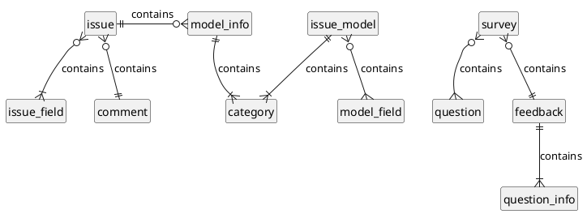
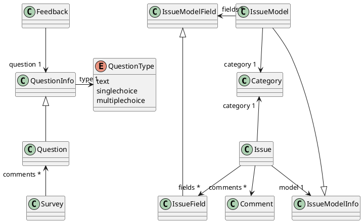

# Codefirst Support

Codefirst Support is an application for reporting issue and answering survey around [Codefirst](https://codefirst.iut.uca.fr/) eco-system.

This repository contains two projects:
- A [React Native](https://reactnative.dev/) application for the frontend: show more [here](docs/app/)
- A [Quarkus](https://quarkus.io/) API for the backend: show more [here](docs/api/)

## Authors
- Florent Marques
    - 
    - 
- Samuel Sirven
    - 
    - 

## Documentation

### Modèle conceptuel de données (MCD)

Vous pouvez retrouver le modèle conceptuel de données complet [ici](docs/api/mcd.md)

### Diagramme de classes des entités

Vous pouvez retrouver le diagramme de classes des entités complet [ici](docs/api/class-diagramm.md)

