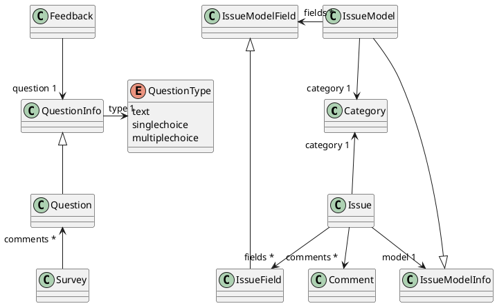

# Codefirst Support

## Documentation

### Modèle conceptuel de données (MCD)

Vous pouvez retrouver le modèle conceptuel de données complet [ici](docs/api/mcd.md)

```plantuml

```

### Diagramme de classes des entités

Vous pouvez retrouver le diagramme de classes des entités complet [ici](docs/api/class-diagramm.md)

```plantuml
@startuml
class Category {
}

class Issue {
}

class IssueModel {
}

class Comment {
}

class IssueField {
}

class IssueModelField {
}

class IssueModelInfo {
}

Issue -up-> "category 1" Category
Issue --> "fields *" IssueField
Issue --> "comments *" Comment
Issue -down-> "model 1" IssueModelInfo

IssueModel --> "category 1" Category
IssueModel -left-> "fields *" IssueModelField

IssueModel -up-|> IssueModelInfo
IssueField -up-|> IssueModelField


class Survey {
}

class Question {
}

enum QuestionType {
  text
  singlechoice
  multiplechoice
}

class Feedback {
}

class QuestionInfo {
}

Survey -up-> "comments *" Question
Feedback --> "question 1" QuestionInfo
QuestionInfo -right-> "type 1" QuestionType

Question -up-|> QuestionInfo
@enduml
```