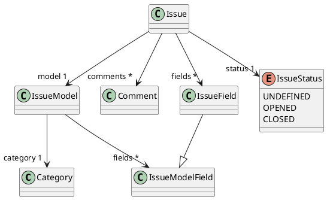
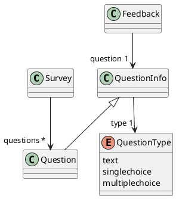

# Codefirst Support

## Documentation

### Modèle conceptuel de données (MCD)

Vous pouvez retrouver le modèle conceptuel de données complet [ici](docs/api/mcd.md)

### Diagramme de classes des entités

#### Tickets

Vous pouvez retrouver le diagramme de classes des entités complet [ici](docs/api/class-diagram-issue.md)

#### Questionnaires

Vous pouvez retrouver le diagramme de classes des entités complet [ici](docs/api/class-diagram-survey.md)

