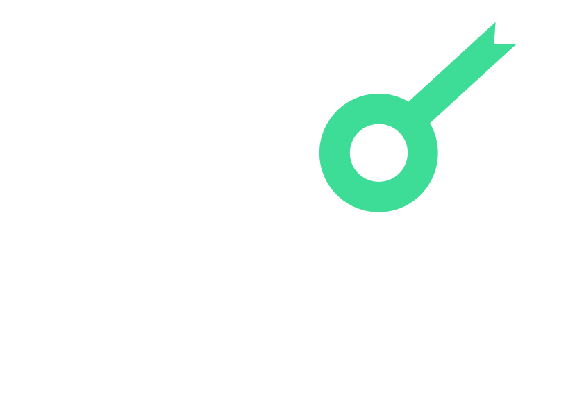
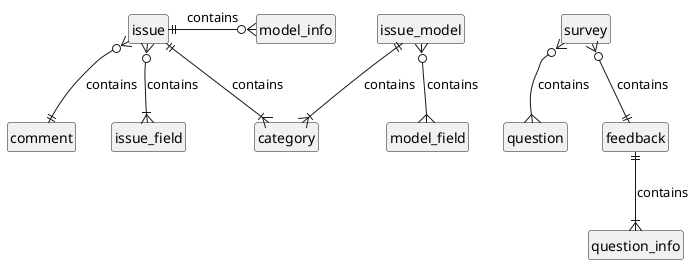
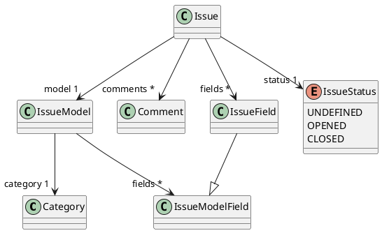
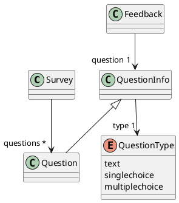

<p align="center">
    
</p>
<h1 align="center">Codefirst Support</h1>
<h3 align="center">Improve students courses</h3>

## Introduction

This application allows users to report issues and answer to surveys available on the app. 

Administrators can create issue models to define a template for the issues. Then, users can select a model and fill the field to post their issue. The admin can post comment to reply to the user to fix the issue.
Administrators can create surveys with some questions then users reply with a feedback.

## 📦 Getting started

Run the api in development mode:

```bash
$ mvwn quarkus:dev
```

## 🛠 Testing

Use the following command to run unit tests:

```bash
$ mvnw quarkus:test
```

## 📝 Documentation

To show the full diagram, click [here](mcd.md).

### Modèle conceptuel de données (MCD)

You can find the entire mcd diagram [here](docs/api/mcd.md).



### Entity class diagram

#### Issues

You can find the entire diagram [here](docs/api/class-diagram-issue.md).



#### Surveys

You can find the entire diagram [here](docs/api/class-diagram-survey.md).



### Database indexes

```json
db.feedbacks.createIndex({survey_id: 1})
```

```json
db.issue_models.createIndex({name: 1})
```

```json
db.issues.createIndex({status: 1, created_at: 1})
```
