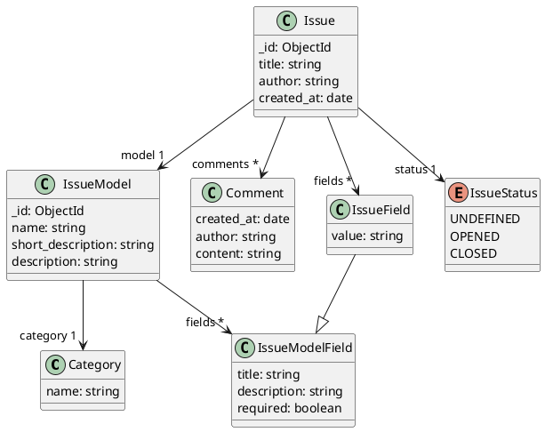

# Diagramme de classe des entités

```plantuml
@startuml

class Category {
  name: string
}

class Issue {
  _id: ObjectId
  title: string
  author: string
  created_at: date
}

class IssueModel {
  _id: ObjectId
  name: string
  short_description: string
  description: string
}

class Comment {
  created_at: date
  author: string
  content: string
}

class IssueField {
  value: string
}

class IssueModelField {
  title: string
  description: string
  required: boolean
}

enum IssueStatus {
  UNDEFINED
  OPENED
  CLOSED
}

Issue --> "fields *" IssueField
Issue --> "comments *" Comment
Issue --> "model 1" IssueModel
Issue --> "status 1" IssueStatus

IssueModel --> "category 1" Category
IssueModel --> "fields *" IssueModelField

IssueField --|> IssueModelField

@enduml
```
