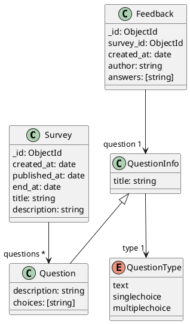

# Diagramme de classe des entités

```plantuml
@startuml

class Survey {
  _id: ObjectId
  created_at: date
  published_at: date
  end_at: date
  title: string
  description: string
}

class Question {
  description: string
  choices: [string]
}

enum QuestionType {
  text
  singlechoice
  multiplechoice
}

class Feedback {
  _id: ObjectId
  survey_id: ObjectId
  created_at: date
  author: string
  answers: [string]
}

class QuestionInfo {
  title: string
}

Survey --> "questions *" Question
Feedback --> "question 1" QuestionInfo
QuestionInfo --> "type 1" QuestionType

Question -up-|> QuestionInfo

@enduml
```
