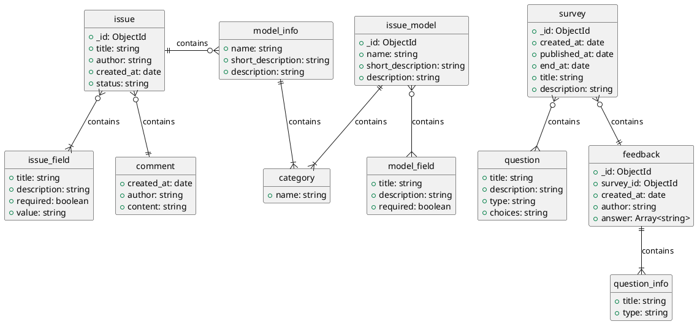

```plantuml
@startuml

hide circle
hide empty members

entity "issue" as issue {
    +_id: ObjectId
    +title: string
    +author: string
    +created_at: date
    +status: string
}

entity "model_info" as model_info {
    +name: string
    +short_description: string
    +description: string
}

entity "category" as category {
     +name: string
}

entity "model_field" as model_field {
    +title: string
    +description: string
    +required: boolean
}

entity "issue_field" as issue_field {
    +title: string
    +description: string
    +required: boolean
    +value: string
}

entity "comment" as comment {
    +created_at: date
    +author: string
    +content: string
}

entity "issue_model" as issue_model {
    +_id: ObjectId
    +name: string
    +short_description: string
    +description: string
}

entity "survey" as survey {
  +_id: ObjectId
  +created_at: date
  +published_at: date
  +end_at: date
  +title: string
  +description: string
}

entity "question" as question {
  +title: string
  +description: string
  +type: string
  +choices: string
}

entity "question_info" as question_info {
  +title: string
  +type: string
}

entity "feedback" as feedback {
  +_id: ObjectId
  +survey_id: ObjectId
  +created_at: date
  +author: string
  +answer: Array<string>
}

issue ||-o{ model_info : contains
issue }o--|| comment : contains
issue }o--|{ issue_field : contains 

model_info ||--|{ category : contains

issue_model }o--{ model_field : contains
issue_model ||--|{ category : contains


survey }o--{ question : contains
survey }o--|| feedback : contains

feedback ||--|{ question_info : contains

@enduml
```