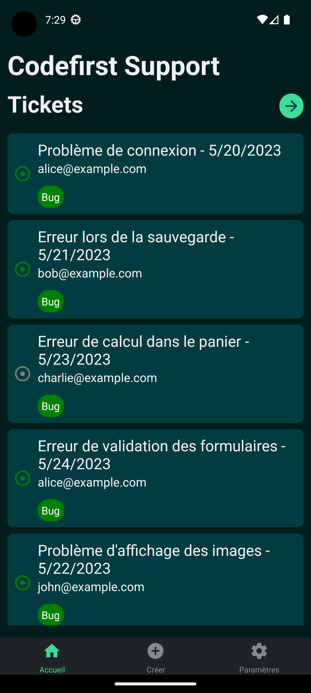
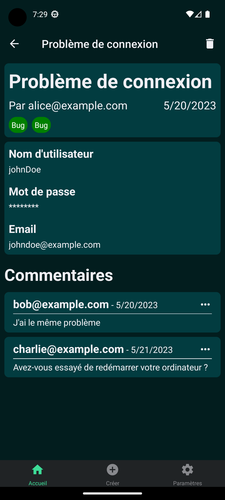
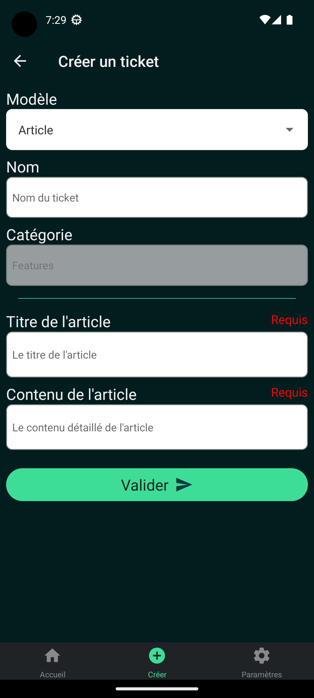
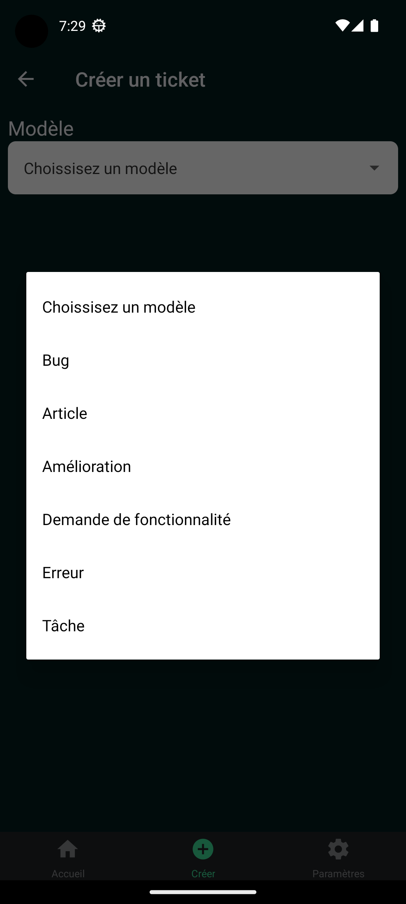

<p align="center">
    
</p>
<h1 align="center">Codefirst Support</h1>
<h3 align="center">Improve students courses</h3>

## Introduction

This application allows users to report issues and answer to surveys available on the app. 

Administrators can create issue models to define a template for the issues. Then, users can select a model and fill the field to post their issue. The admin can post comment to reply to the user to fix the issue.
Administrators can create surveys with some questions then users reply with a feedback.

## 🧑🏻‍🎨 Figma

You can find here the application sketches on Figma:

<p align="center">
  <a href="https://www.figma.com/file/9PdjC3vRghwZ7MBWjR9ZSK/CodefirstSupport?type=design&node-id=0%3A1&mode=design&t=qAcELdSr4RvmC8nI-1">
    
  </a>
</p>


## 📸 Screenshots






## 🗺️ Roadmap

### Issue models
- [ ] List all issue models
- [ ] Show an issue model
- [ ] Create an issue model
- [ ] Delete an issue model
- [ ] Search an issue model by name

### Issues
- [x] List all issues
- [x] Show an issue
- [x] Create an issue from issue model
- [x] Delete an issue
- [ ] Search an issue by name
- Search an issue with filters
    - [ ] Status
    - [ ] Category
    - [ ] Owner

### Comments
- [ ] Add a comment on issue
- [ ] Delete a comment on issue

### Users
- [ ] Choose user account
- [ ] Display user avatar
- [ ] Show user details in settings

### Theme
- [x] Select user theme mode
- [x] Save theme in preferences

### Surveys
- [ ] List all surveys
- [ ] Show a survey
- [ ] Delete a survey
- [ ] Search a survey by name
- [ ] Search a survey with filters
- [ ] Add a feedback for the survey

## 📦 Getting started

Installing Dependencies:

```bash
$ yarn
```

Running the app:

```bash
$ yarn start
```

For starting the app on a specific OS:

```bash
$ yarn ios | yarn android
```

## 🛠 Testing

Use the following command to run unit tests:

```bash
$ yarn test
```
